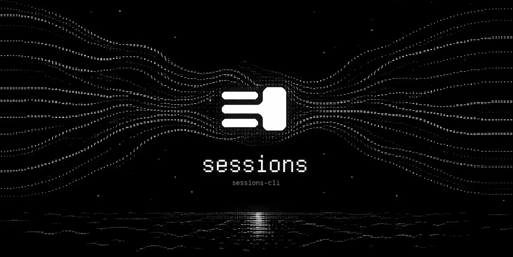
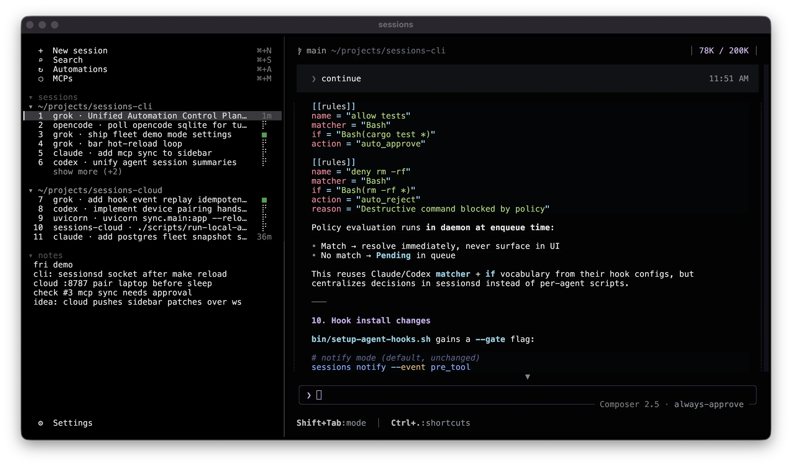

> [!CAUTION]
> **Research Preview** — sessions-cli is an experimental research preview, not a production-ready release. Behavior, configuration, on-disk formats, and APIs may change significantly between versions. Expect incomplete features, bugs, and rough edges. It is intended for early adopters exploring multi-agent session workflows and sharing feedback—not for workflows where stability is critical.



<p align="center"><strong>The multi-agent session manager for your terminal.</strong></p>



---

Sessions is a terminal-native session manager for people working across multiple AI coding agents, repos, panes, and long-running workflows. It keeps live session state visible in one sidebar while letting each agent keep its own TUI, model-specific behavior, and native integrations.

The goal is to centralize the workflow without wrapping every AI tool in another frontend. Modern agent TUIs are improving quickly, and wrapping them often means losing the features that make them useful. sessions-cli leans into those native tools instead of replacing them.

The project exists to make good user-flows portable. Common pieces such as MCPs, skills, automations, hooks, notifications, and session state should be managed in one efficient package, then shared across the models where they fit. That lets you keep a stable workflow while still using the best model for each task, and makes it easier to try agents you might otherwise avoid.

Please [report issues](https://github.com/sessions-cli/sessions-cli/issues) when you hit problems; real workflow failures are the most useful signal for shaping the next layer.

A companion service, session-cloud, is also in development as a self-sustaining backbone for sessions across different models, centralizing the parts model vendors do not.

---

## Quick Start

**Requirements:** macOS or Linux, [tmux](https://github.com/tmux/tmux/wiki), [Rust](https://rustup.rs/) (install compiles from source), and at least one supported agent CLI (Grok, Codex, Claude, or OpenCode).

```bash
# One-line install (clone, build, deploy, configure hooks, start daemon)
curl -fsSL https://raw.githubusercontent.com/sessions-cli/sessions-cli/main/install.sh | bash

# Open Sessions
sessions
```


## Core Features

Sessions is early — some pieces are solid, others are wired but unfinished. The goal is one place to run and watch every session, without replacing the tools you already use.

| Feature | Description | Status |
|---|---|---|
| Session sidebar | Sidebar lists every agent thread, dev server, and terminal, grouped by working directory / project, agent hooks report live status (working, approval, error, done) | 🟡 In progress |
| New session launcher | Pick project, agent, and model, enter a prompt, choose Open or Background; Sessions opens a new tmux window with the native agent binary | 🟡 In progress |
| MCP management | Browse installed MCP servers, toggle enablement per agent, sync into Grok, Codex, and Claude configs, and restart agent sessions to pick up changes | 🟡 In progress |
| File tree explorer | Right sidebar shows a live file tree of that session's working directory so you can browse the repo without leaving the UI | 🟡 In progress |
| Nested workspaces | Multi-agent pane view to watch several agents in one directory or several at once in an organised multi-agent workspace | 🟡 In progress |
| Search | Search sessions and threads across all workspaces/agents | 🟡 In progress |
| Automations | Agent loops, cron schedules, and hook triggers — detached workflows that run on a timer or in response to events, across repos and agents, locally or on sessions-cloud | 🟡 In progress |
| sessions-cloud | Sign in to hosted backbone to sync workflow state and team visibility across machines; local sidebar and CLI stay the primary interface | 🟡 In progress | 


### Session sidebar

Agents report state through hooks. In the sidebar you see who is thinking, who needs approval, who hit an error, and who finished — without switching panes:

| State | What you see |
|---|---|
| idle | default row |
| working | spinner |
| approval | amber highlight |
| error | red highlight |
| done | green highlight, bell |

A finished thread stays highlighted until you switch to it. Groups sort by recent activity; rename or delete from the right-click menu, drag headers to reorder, and use the notepad below the list for scratch notes across your sessions.


### Supported agents

Sessions does not wrap agent TUIs. **Every agent on this list can be used** — launch from `⌘N` or start the native binary in any workspace pane. **Status** tracks sidebar integration only: thread names in the session list and live turn state (working, approval, error, done).

| Agent | Status |
|---|---|
| [**Grok**](https://x.ai/cli) | 🟡 In progress |
| [**Codex**](https://github.com/openai/codex) | 🟡 In progress |
| [**Claude**](https://github.com/anthropics/claude-code) | 🟡 In progress |
| [**OpenCode**](https://github.com/anomalyco/opencode) | 🟡 In progress |
| [**Aider**](https://github.com/Aider-AI/aider) | 🔜 Coming |
| [**Amp**](https://ampcode.com) | 🔜 Coming |
| [**Antigravity CLI**](https://github.com/google-antigravity/antigravity-cli) | 🔜 Coming |
| [**Cline**](https://github.com/cline/cline) | 🔜 Coming |
| [**Crush**](https://github.com/charmbracelet/crush) | 🔜 Coming |
| [**Cursor**](https://cursor.com/cli) | 🔜 Coming |
| [**Droid**](https://github.com/Factory-AI/factory) | 🔜 Coming |
| [**GitHub Copilot CLI**](https://github.com/github/copilot-cli) | 🔜 Coming |
| [**Goose**](https://github.com/aaif-goose/goose) | 🔜 Coming |
| [**Hermes**](https://github.com/NousResearch/hermes-agent) | 🔜 Coming |
| [**Junie**](https://github.com/JetBrains/junie) | 🔜 Coming |
| [**Kilo Code**](https://github.com/Kilo-Org/kilocode) | 🔜 Coming |
| [**Kimi Code**](https://github.com/MoonshotAI/kimi-cli) | 🔜 Coming |
| [**Kiro**](https://github.com/kirodotdev/Kiro) | 🔜 Coming |
| [**Letta Code**](https://github.com/letta-ai/letta-code) | 🔜 Coming |
| [**MiMo Code**](https://github.com/XiaomiMiMo/MiMo-Code) | 🔜 Coming |
| [**Mistral Vibe**](https://github.com/mistralai/mistral-vibe) | 🔜 Coming |
| [**nori-cli**](https://github.com/tilework-tech/nori-cli) | 🔜 Coming |
| [**OpenClaw**](https://github.com/openclaw/openclaw) | 🔜 Coming |
| [**OpenHands**](https://github.com/OpenHands/OpenHands) | 🔜 Coming |
| [**Pi**](https://github.com/earendil-works/pi) | 🔜 Coming |
| [**Plandex**](https://github.com/plandex-ai/plandex) | 🔜 Coming |
| [**Qwen Code**](https://github.com/QwenLM/qwen-code) | 🔜 Coming |

| Status | Meaning |
|---|---|
| 🟡 In progress | Session names and/or turn status integration underway |
| 🔜 Coming | Not integrated yet — agent still runs as a session |

**Want a CLI tool here?** Sessions works with native agent binaries, not wrappers. If it's not listed, [open a pull request](https://github.com/sessions-cli/sessions-cli/pulls) to add it.


### Shortcuts

| Key | Action |
|---|---|
| `Enter` | open session |
| `j` / `k` | move selection |
| `1`–`9`, `0`, `11+` | focus by number |
| hold `d` | close session |
| `⌘N` | new session |
| `⌘T` | new raw terminal |
| `⌘G` | new Grok session |
| `⌘C` | new Claude session |
| `⌘X` | new Codex session |
| `⌘O` | new OpenCode session |
| `⌘S` | search — coming |
| `⌘A` | automations — coming |
| `⌘M` | MCPs — coming |
| `⌘,` | toggle settings |
| `Ctrl+q` | detach UI |
| `Ctrl-g` `1`–`9`, `0` | focus workspace window |
| `Ctrl-g` `o` | cycle panes |
| `Ctrl-g` `m` | toggle mouse |
| `Esc` | close settings |


## Configuration

| Variable | Default |
|---|---|
| `SESSIONS_DATA_DIR` | `~/.local/share/sessions` |
| `SESSIONS_INSTALL_DIR` | `~/.local/share/sessions/bin` |
| `SESSIONS_BIN` | resolved from install dir / PATH |


## Development

```bash
make install   # build + deploy
make reload    # build + deploy + restart daemon and sidebar
```


## Uninstall

```bash
curl -fsSL https://raw.githubusercontent.com/sessions-cli/sessions-cli/main/uninstall.sh | bash
```


## Documentation

See [`docs/`](docs/README.md) for architecture notes, audits, and plans.


## Contributing

If you're interested in contributing to Sessions, please read [CONTRIBUTING.md](CONTRIBUTING.md) before submitting a pull request.


## License

Licensed under [Apache License 2.0](LICENSE).

sessions-cli is the open-source community edition. [session-cloud](docs/ROADMAP.md#session-cloud) builds on it as the hosted backbone — the CLI stays local-first and permissively licensed so anyone can adopt, extend, and contribute without friction.